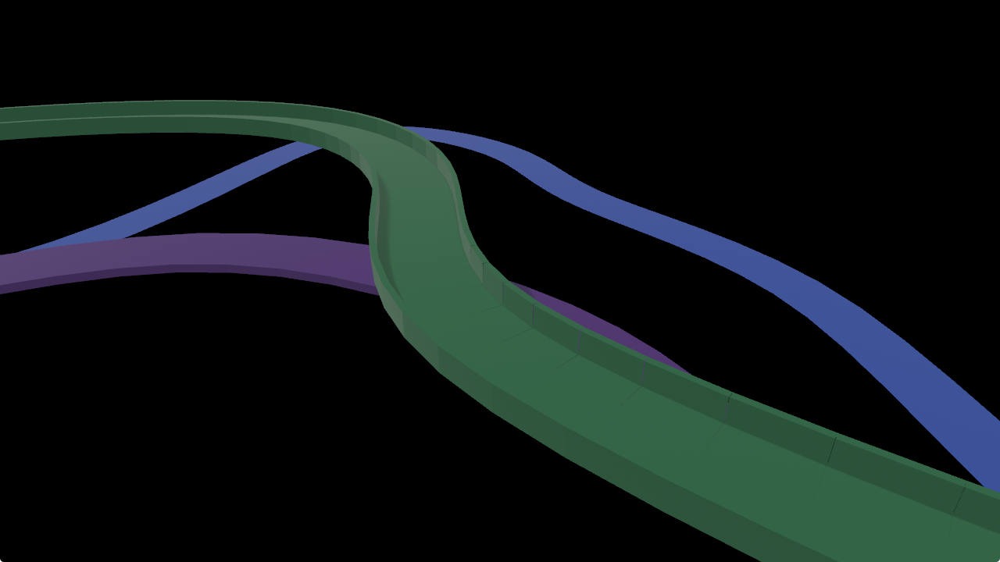
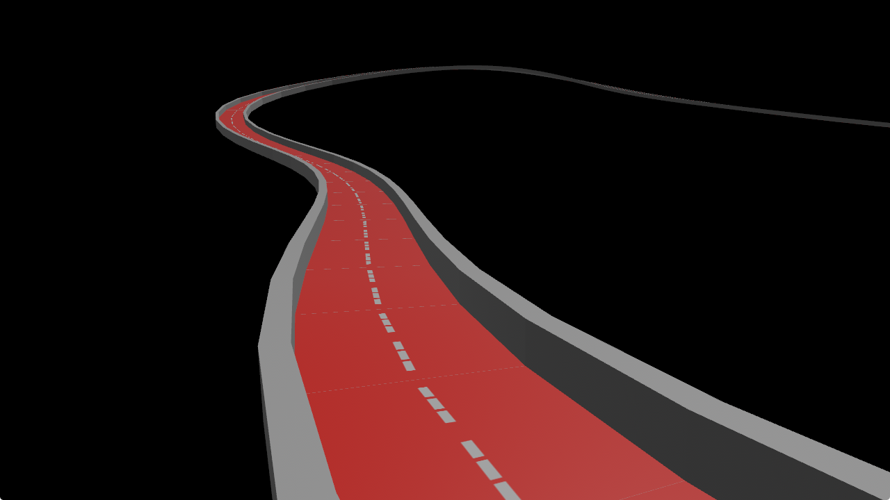

# Procedural Track
I probably invented the wheel. But I needed a random track, I searched around and didn't find one. :)
I had to do it myself, but I did it as best I could. Feel free to use it if you need it.

## So, what profiles do we have?
1 Flat (blue)  
2 Box (purple)  
3 Square Channel (green)  
4 Custom  (please refer to ([custom_profile](/examples/custom_profile.rs)))  

    
 you can use texture  
 
   
 and here's a stupid triangular profile as a case of a custom profile  
 
   

## How to use it
please refer to ([basic example](/examples/basic.rs))

### Need a source of points 
(Vector of Vec3)
For example, you can use  [bevy_random_loop](https://github.com/xenon615/bevy_random_loop.git)
```rust
    let mut points = RandomLoop::generate(12, vec3(100., 0., 150.));
    RandomLoop::vary(&mut points, variation );
    RandomLoop::smooth_out(&mut points, 120f32.to_radians(), min_segment_len);

```
or any formula to your taste, for example 

```rust

    let points = (0 .. 20).map(| i | vec3(i as f32, 0., (i as f32).to_degrees().sin() )).collect::<Vec<_>>();
    
```

then apply the spline and calculate binormal
```rust
let spline = CubicBSpline::new(points).to_curve_cyclic().unwrap();  //  to_curve_cyclic()  for closed path  to_curve  - otherwise
    let points = spline.iter_positions(sub_div)
        .zip(spline.iter_velocities(sub_div))
        .map(| ( p, v ) | ( p, v.normalize().cross(Vec3::Y).normalize() ))
        .collect::<Vec<_>>()
    ;
```
then build the mesh 

```rust
let mesh = track_mesh(&points, EpFlat{half_width: 4.}, true);

    let mesh = meshes.add(mesh);
    cmd.spawn((
        Mesh3d(mesh.clone()),
        MeshMaterial3d(materials.add(Color::from(css::ROYAL_BLUE))),
    ));

```
